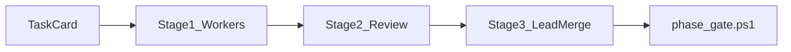

# Council orchestration — StudyPilot v2

Adapted from [Karpathy LLM Council](https://github.com/karpathy/llm-council) **3-stage deliberation** for **engineering governance**, not student Q&A.

**Related:** [LEAD_ORCHESTRATOR.md](LEAD_ORCHESTRATOR.md) · [MULTI_AGENT_WORKFLOW.md](MULTI_AGENT_WORKFLOW.md) · [config/council/studypilot-board.yaml](../config/council/studypilot-board.yaml)

---

## Three stages

| Stage | Karpathy | StudyPilot |
|-------|----------|------------|
| **1 — Propose** | Parallel LLM responses | **2–3 worker chats** (Agents B/C/D/E) with scoped task cards |
| **2 — Review** | Anonymized peer ranking | Lead + checklist: [failures-checklist.md](failures-checklist.md), ownership, eval impact |
| **3 — Synthesize** | Chairman final answer | Lead picks approach, user runs `phase_gate.ps1`, merge |



---

## When council is mandatory (Stage 2)

- Edits to `retrieve.py`, `rerank.py`, `gate.py`
- Changes to `eval/golden_set.jsonl` (human approval required)
- Alembic / `models.py` / `docs/api-contracts.md`
- `min_rerank_score` or eval threshold changes

## Fast path (no council)

- Agent E UI/CSS in `apps/web/**`
- Documentation typos
- Seed YAML comments (not question counts)

---

## Cursor skills

| Skill | Stage |
|-------|-------|
| `.cursor/skills/council-propose-slice/SKILL.md` | 1 |
| `.cursor/skills/council-review-slice/SKILL.md` | 2 |
| `.cursor/skills/council-merge-slice/SKILL.md` | 3 |
| `.cursor/skills/run-eval-gate/SKILL.md` | Gate |

Invoke: *"Follow council-propose-slice for Agent E heatmap UI"*

---

## Worker task card template

```
You are Agent <B|C|D|E> for studypilot-v2.
Read: docs/CURRENT_STATE.md, AGENTS.md, docs/failures-checklist.md
Own ONLY: <paths>
FORBIDDEN: <paths>
Acceptance: pytest / user runs phase_gate or eval as specified
Return: summary + files changed + risks for Stage 2 review
```

---

## Do NOT

- Run multi-model OpenRouter council on every code change (cost)
- Port Karpathy council into `/api/v1/query` (student path stays RAG)
- Skip Stage 2 on retrieval or schema changes
- Use `run_phase1b_eval.ps1` (4-sweep) — use `run_phase1b_eval_fast.ps1`
