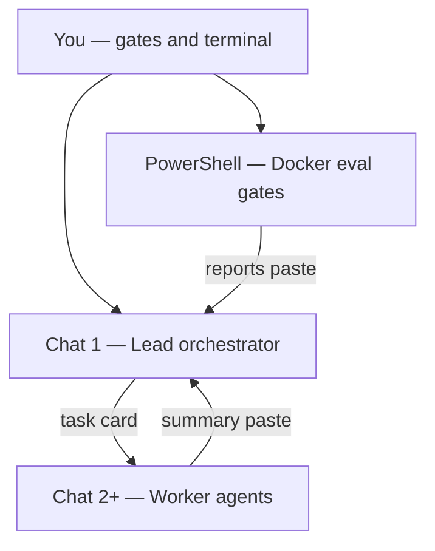

# Multi-agent workflow (without Multitask Mode)

How to run **lead orchestrator + worker agents** in StudyPilot v2 **without** Cursor Multitask Mode — faster, visible, and avoids empty agent-shell issues.

**Related:** [LEAD_ORCHESTRATOR.md](LEAD_ORCHESTRATOR.md) · [NEW_CHAT_PROMPT.md](NEW_CHAT_PROMPT.md) · [CURRENT_STATE.md](CURRENT_STATE.md) · [AGENTS.md](../AGENTS.md)

---

## Why not Multitask?

| Multitask Mode on | Manual multi-agent (this doc) |
|-------------------|-------------------------------|
| Background workers auto-spawn in one chat | **You** open 1–2 worker chats when needed |
| Hard to see progress; easy to abort mid-run | Every worker is a separate, disposable chat |
| Agent shell often returns empty for Docker/eval | **You** run Docker/eval in PowerShell |
| One conversation grows huge and slow | Lead chat stays small; workers closed when done |

You still get **multiple agents** — orchestrator + workers + file ownership — without Multitask overhead.

---

## Three roles



| Role | Where | Job |
|------|--------|-----|
| **Lead orchestrator** | One long-lived chat | Plan, write task cards, review, update `CURRENT_STATE.md` |
| **Worker agent** | New chat per slice | Implement one owned area; then close chat |
| **You (human)** | Terminal + approvals | Run `docker`, `run_phase1b_eval_fast.ps1`, `phase_gate.ps1`; approve task cards and merges |

---

## Chat setup checklist

### Before any new chat

1. **New chat** — never continue a 100+ message thread for orchestration.
2. **Multitask Mode OFF** — unless you explicitly want background workers.
3. **@-mention only what’s needed** — usually `docs/CURRENT_STATE.md` + `docs/LEAD_ORCHESTRATOR.md` for lead; worker gets paths from task card.
4. **Agent mode** — not Plan mode when implementing.

### What runs where

| Task | Who runs it |
|------|-------------|
| `docker compose up -d` | **Your terminal** |
| `run_phase1b_eval_fast.ps1` | **Your terminal** |
| `phase_gate.ps1 -Phase 1c` | **Your terminal** |
| Code edits in owned paths | **Worker chat** |
| Task cards, phase decisions | **Lead chat** |
| Update `CURRENT_STATE.md` | **Lead chat** (after you confirm gate) |

**Never ask the agent to “run eval as administrator”** — that caused 20+ minute runs and empty output in prior sessions.

---

## Prompt 1 — Lead orchestrator (new chat)

**When:** Start of a phase, or when replacing a slow/old orchestrator chat.

**Attach / @:** `docs/CURRENT_STATE.md`, `docs/LEAD_ORCHESTRATOR.md`

**Copy-paste:**

```
You are the LEAD ORCHESTRATOR for StudyPilot v2 (repo: C:\Projects\studypilot-v2).

Read in order:
1. docs/CURRENT_STATE.md
2. docs/LEAD_ORCHESTRATOR.md
3. AGENTS.md
4. docs/api-contracts.md
5. eval/golden_set.jsonl (skim — do not rewrite)
6. C:\Users\Owner\.cursor\plans\path_a_lean_rebuild_0f4ce0e9.plan.md — Part 10 and Part 11 ONLY (read-only)

Rules:
- Do NOT edit C:\Users\Owner\.cursor\plans\*.plan.md
- Phase 0, 1a, 1b CODE IS DONE — do not rebuild unless proven bug with evidence
- Current target: Phase 1c eval gate (precision@5 >= 70%, OOC 10/10)
- Use scripts/run_phase1b_eval_fast.ps1 ONLY — never run_phase1b_eval.ps1 (4-sweep)
- I run Docker, pytest, and eval in MY PowerShell — you analyze pasted reports
- You delegate work via TASK CARDS for separate worker chats — do not implement large slices yourself
- Max 2 active worker chats; one file, one owner
- Update docs/CURRENT_STATE.md when phase status changes

Your first response:
1. Confirm phase/blocker from CURRENT_STATE.md
2. Ask me to paste eval/reports/PHASE1B_SUMMARY_FOR_AGENT.txt OR give exact terminal commands to run
3. Propose next step (tune threshold / worker task / phase gate) — no Phase 2 UI until 1c PASS

Acceptance: .\scripts\phase_gate.ps1 -Phase 1c PASS in my terminal.
```

**Optional first follow-up from you:**

```
Here is my latest eval:
[paste PHASE1B_SUMMARY_FOR_AGENT.txt]

Propose Phase 1c plan only. If you need a worker, output a full TASK CARD I can paste into a new chat.
```

More prompts: [NEW_CHAT_PROMPT.md](NEW_CHAT_PROMPT.md)

---

## Prompt 2 — Worker agent (new chat per task)

**When:** Lead gives you a task card; you open a **separate** Composer chat.

**Do not** paste the lead chat history — only the task card + @ owned files.

### Task card template (lead fills in `ALL CAPS`)

```
You are Agent AGENT_SLOT for studypilot-v2 Phase PHASE.

Read first (read-only unless listed in OWN ONLY):
- docs/CURRENT_STATE.md
- AGENTS.md
- docs/api-contracts.md
- docs/failures-checklist.md
- eval/golden_set.jsonl

OWN ONLY:
- PATH_ONE
- PATH_TWO

FORBIDDEN:
- FORBIDDEN_PATHS
- .cursor/plans/**
- eval/golden_set.jsonl (unless human explicitly approved eval edit)

Task:
TASK_DESCRIPTION

Constraints:
- Minimal diff; match existing code style
- Do not run Docker or full golden replay — tell me what to run to verify

When done, reply with:
1. Files changed (list)
2. What you changed and why (3-5 bullets)
3. Exact verify commands for my terminal
```

### Example — Agent C (retrieval tune, Phase 1c)

```
You are Agent C (retrieval) for studypilot-v2 Phase 1c.

Read first:
- docs/CURRENT_STATE.md
- AGENTS.md
- docs/api-contracts.md
- docs/failures-checklist.md

OWN ONLY:
- apps/api/app/services/rag/retrieve.py
- apps/api/app/services/rag/rerank.py
- apps/api/app/services/rag/gate.py
- apps/api/tests/test_retrieval_golden.py
- apps/api/tests/test_gate_refusal.py

FORBIDDEN:
- apps/api/app/services/ingestion.py
- apps/api/app/services/chunker/**
- apps/web/**
- .cursor/plans/**

Task:
Improve retrieval for golden miss IDs: ppl-001, ppl-002, ppl-004 (expected pages in golden_set.jsonl).
Do NOT edit golden_set.jsonl.

When done:
1. List files changed
2. Explain approach
3. Tell me: cd C:\Projects\studypilot-v2; $env:MIN_RERANK_SCORE="0.35"; .\scripts\run_phase1b_eval_fast.ps1
```

### Example — Agent E (UI, Phase 2 — after 1c green)

```
You are Agent E (web UI) for studypilot-v2 Phase 2.

Read: docs/CURRENT_STATE.md, AGENTS.md, docs/api-contracts.md (HTTP section)

OWN ONLY:
- apps/web/**

FORBIDDEN:
- apps/api/app/services/rag/**
- apps/api/app/services/ingestion.py
- chunker/**

Task:
Minimal single-page UI: upload with doc_kind, query box, show answer + citations + rerank debug panel per api-contracts.md.

Verify: npm run dev; manual demo of 3 golden questions.
```

### Example — Explore-only (no edits)

```
Read-only audit. Do NOT edit any files.

Read: eval/golden_set.jsonl, eval/reports/latest.jsonl, docs/CURRENT_STATE.md

Task:
List top 5 retrieval misses with expected vs retrieved pages and likely cause (chunk boundary, gate threshold, query wording).

Output: markdown table only. I will paste results into the lead orchestrator chat.
```

---

## Prompt 3 — Return to lead (same lead chat)

After worker finishes, paste into **lead chat** (not worker chat):

```
Worker Agent C completed.

Summary:
[paste worker's closing message]

Eval after worker (if I ran it):
[paste PHASE1B_SUMMARY_FOR_AGENT.txt]

Decide: merge mentally / next task / run phase_gate.ps1 -Phase 1c
```

Lead updates `CURRENT_STATE.md` only after **you** confirm gate PASS.

---

## Human gates

| Gate | When | You do |
|------|------|--------|
| **Gate 1** | Before opening worker chat | Approve task card from lead |
| **Gate 2** | Before lead declares phase done | Run `.\scripts\phase_gate.ps1 -Phase <n>` in terminal; paste result |

---

## Phase 1c workflow (current)

1. **Lead chat** — read state; ask for eval report or give smoke commands.
2. **You** — smoke eval:
   ```powershell
   cd C:\Projects\studypilot-v2
   $env:GOLDEN_LIMIT = "10"
   $env:MIN_RERANK_SCORE = "0.40"
   .\scripts\run_phase1b_eval_fast.ps1
   Remove-Item Env:GOLDEN_LIMIT -ErrorAction SilentlyContinue
   ```
3. **You** — full eval:
   ```powershell
   $env:MIN_RERANK_SCORE = "0.35"
   .\scripts\run_phase1b_eval_fast.ps1
   type eval\reports\PHASE1B_SUMMARY_FOR_AGENT.txt
   ```
4. If misses remain → **lead writes task card** → **new worker chat** → you re-run fast eval.
5. **You** — `.\scripts\phase_gate.ps1 -Phase 1c`
6. **Lead** — update `CURRENT_STATE.md` → Phase 1c DONE → plan Phase 2.

---

## Speed rules (avoid slow chats)

| Do | Don't |
|----|--------|
| New chat per phase | One endless orchestrator thread |
| Lead plans; workers code | Lead implements large rag/web slices |
| `GOLDEN_LIMIT=10` smoke first | 4-threshold sweep script |
| Paste 2–3 report files | “Search entire PC for Docker” again |
| Close worker chat when done | Keep 5 stale worker threads |
| Multitask OFF | Background agents for eval/Docker |

---

## File ownership quick reference

| Agent | Owns | Phase |
|-------|------|-------|
| B | ingest, chunker, pdf_extract | 1a (done) |
| C | retrieve, rerank, gate | 1b/1c |
| D | generate, pipeline LLM | post-1c |
| E | apps/web/** | 2 |
| Lead | docs/**, scripts/**, merges | all |

Full matrix: [orchestrator.md](orchestrator.md) · [AGENTS.md](../AGENTS.md)

---

## Cursor rules (auto-loaded)

- `.cursor/rules/lead-orchestrator.mdc` — lead reads `CURRENT_STATE.md` first
- `.cursor/rules/orchestrator.mdc` — ownership and gates

Keep these enabled in new chats.
